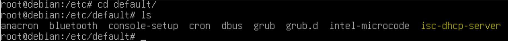
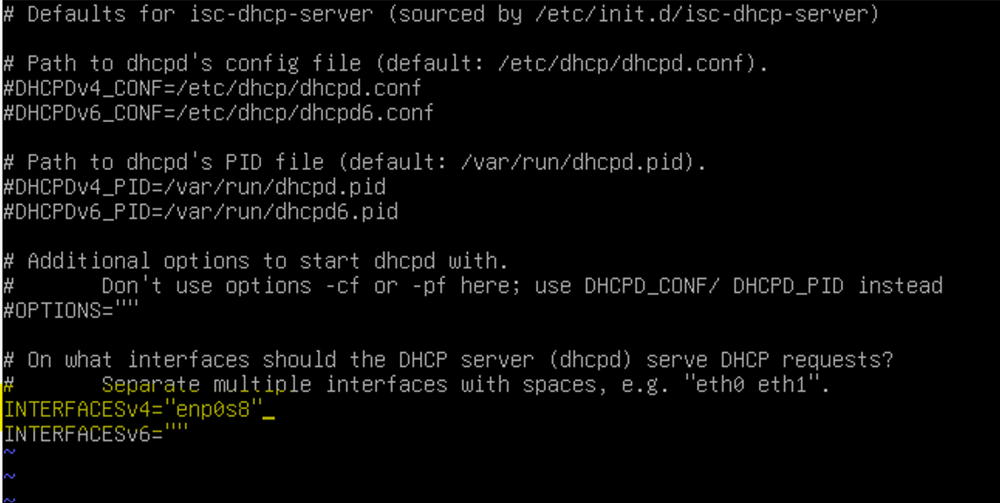
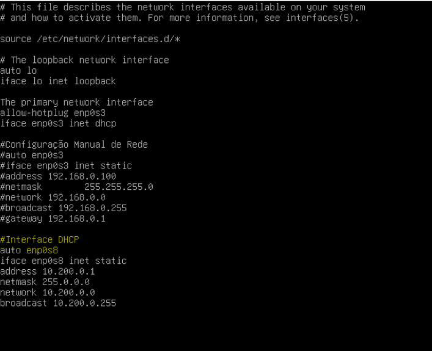

# 🛠️ Laboratório DHCP no Linux (Debian 13)

## 📘 Descrição Geral

Este laboratório tem como objetivo demonstrar a configuração completa de um servidor **DHCP**  
em um ambiente Linux Debian 13, utilizando máquinas virtuais no VirtualBox para simular uma  
rede LAN interna.

O cenário foi projetado para representar uma topologia de rede realista, onde o Debian 13  
virtualizado atua como servidor DHCP responsável por fornecer configurações automáticas de  
endereçamento IP para clientes conectados à rede interna.

O ambiente foi implementado sobre um host **Windows 11**, que utiliza uma interface de rede  
física Intel(R) Wireless-AC 9560 para acesso à Internet e comunicação com o roteador doméstico,  
cujo endereço `192.168.0.1` também fornece serviço DHCP na rede externa.

Dentro do VirtualBox, foi criada uma interface em modo **Bridge** (`enp0s3`) para comunicação  
entre o host e o servidor Debian, e uma interface **interna** (`enp0s8`) que conecta o servidor  
Debian ao cliente Windows 10 virtualizado, formando uma sub-rede isolada Classe A (`10.200.0.0/24`)  
para os testes do serviço DHCP.

Essa arquitetura permite validar o funcionamento do serviço em um ambiente controlado,  
simulando a atuação de um servidor DHCP real em redes corporativas.

---

## 🧩 Objetivos do Projeto

- 🖥️⚙️ Instalar e configurar o serviço **DHCP** no Debian 13.  
- 🌐📡 Fornecer configurações automáticas de IP para clientes conectados à rede interna  
  (sub-rede `10.200.0.0/24`).  
- ✅💻 Validar o funcionamento do servidor DHCP através de uma estação cliente Windows 10  
  virtualizada, garantindo que o cliente obtenha corretamente as configurações de rede.


# 🧾 DOCUMENTAÇÃO – CONFIGURAÇÃO DO SERVIDOR DHCP (ISC-DHCP-SERVER) NO DEBIAN

🔹 1. Instalação e acesso ao diretório padrão de configuração

Antes de realizar as configurações, é necessário instalar o pacote do servidor DHCP no Debian.
O serviço utilizado neste laboratório é o ISC-DHCP-SERVER, um dos mais usados em ambientes Linux.

Execute os comandos abaixo para realizar a instalação:
````bash
apt update
apt install isc-dhcp-server -y
````

## 🔹 2. Acesso ao diretório padrão de configuração

```bash
cd /etc/default
ls
```




O primeiro passo é navegar até o diretório `/etc/default`, onde estão localizados os arquivos de  
configuração padrão de diversos serviços do sistema.

Neste diretório, encontramos o arquivo `isc-dhcp-server`, responsável por armazenar as definições  
de inicialização e as interfaces de rede que o serviço **DHCP** utilizará.

É neste arquivo que especificamos **qual placa de rede o serviço vai usar para distribuir endereços IP**.
<br><br><br><br>
## 🔹 3. Editando o arquivo padrão do serviço

📸 Imagem:  


Abrimos o arquivo de configuração padrão do serviço **DHCP**:

```bash
nano /etc/default/isc-dhcp-server
```
Dentro dele, configuramos a interface de rede responsável por responder aos pedidos DHCP:

INTERFACESv4="enp0s8"  

INTERFACESv6=""

INTERFACESv4: define a interface de rede IPv4 (no caso, enp0s8).

INTERFACESv6: vazio, pois não estamos usando DHCPv6.

💡 Essa configuração garante que o serviço ISC-DHCP-Server escute e distribua IPs apenas pela
interface enp0s8, evitando conflitos com outras interfaces do sistema.
<br><br><br>

## 🔹 4. Configurando a interface de rede no sistema

📸 Imagem:  


Agora, configuramos o arquivo `/etc/network/interfaces` para definir os parâmetros de rede da interface  
usada pelo DHCP.

```bash
nano /etc/network/interfaces
```
Adicionamos a configuração manual da interface enp0s8, que será a interface servidora DHCP (rede interna):
# Interface DHCP
```bash
auto enp0s8
iface enp0s8 inet static
address 10.200.0.1
netmask 255.255.0.0
network 10.200.0.0
broadcast 10.200.0.255
```
🔸 Explicação dos parâmetros:

address: IP fixo do servidor DHCP (gateway da rede interna).

netmask: máscara de rede.

network: endereço da rede.

broadcast: endereço de broadcast da sub-rede.

💡 Essa interface servirá como gateway e ponto de distribuição de endereços IP para os clientes DHCP.
