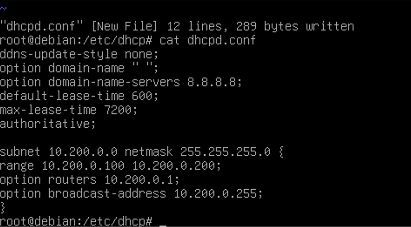

# 🛠️ Laboratório DHCP no Linux (Debian 13)

# 📘 Descrição Geral

Este laboratório tem como objetivo demonstrar a configuração completa de um servidor **DHCP**  
em um ambiente Linux Debian 13, utilizando máquinas virtuais no VirtualBox para simular uma  
rede LAN interna.

O cenário foi projetado para representar uma topologia de rede realista, onde o Debian 13  
virtualizado atua como servidor DHCP responsável por fornecer configurações automáticas de  
endereçamento IP para clientes conectados à rede interna.

O ambiente foi implementado sobre um host **Windows 11**, que utiliza uma interface de rede  
física Intel(R) Wireless-AC 9560 para acesso à Internet e comunicação com o roteador doméstico,  
cujo endereço `192.168.0.1` também fornece serviço DHCP na rede externa.

Dentro do VirtualBox, foi criada uma interface em modo **Bridge** (`enp0s3`) para comunicação  
entre o host e o servidor Debian, e uma interface **interna** (`enp0s8`) que conecta o servidor  
Debian ao cliente Windows 10 virtualizado, formando uma sub-rede isolada Classe A (`10.200.0.0/24`)  
para os testes do serviço DHCP.

Essa arquitetura permite validar o funcionamento do serviço em um ambiente controlado,  
simulando a atuação de um servidor DHCP real em redes corporativas.

---

# 🧩 Objetivos do Projeto

- 🖥️⚙️ Instalar e configurar o serviço **DHCP** no Debian 13.  
- 🌐📡 Fornecer configurações automáticas de IP para clientes conectados à rede interna  
  (sub-rede `10.200.0.0/24`).  
- ✅💻 Validar o funcionamento do servidor DHCP através de uma estação cliente Windows 10  
  virtualizada, garantindo que o cliente obtenha corretamente as configurações de rede.


# 🧾 DOCUMENTAÇÃO – CONFIGURAÇÃO DO SERVIDOR DHCP (ISC-DHCP-SERVER) NO DEBIAN

# 🔹 1. Instalação e acesso ao diretório padrão de configuração

Antes de realizar as configurações, é necessário instalar o pacote do servidor DHCP no Debian.
O serviço utilizado neste laboratório é o ISC-DHCP-SERVER, um dos mais usados em ambientes Linux.

Execute os comandos abaixo para realizar a instalação:
````bash
apt update
apt install isc-dhcp-server -y
````
<br><br>
# 🔹 2. Acesso ao diretório padrão de configuração

```bash
cd /etc/default
ls
```


O primeiro passo é navegar até o diretório `/etc/default`, onde estão localizados os arquivos de  
configuração padrão de diversos serviços do sistema.

Neste diretório, encontramos o arquivo `isc-dhcp-server`, responsável por armazenar as definições  
de inicialização e as interfaces de rede que o serviço **DHCP** utilizará.

É neste arquivo que especificamos **qual placa de rede o serviço vai usar para distribuir endereços IP**.
<br><br>

# 🔹 3. Editando o arquivo padrão do serviço

📸 Imagem:  


Abrimos o arquivo de configuração padrão do serviço **DHCP**:

```bash
nano /etc/default/isc-dhcp-server
```
Dentro dele, configuramos a interface de rede responsável por responder aos pedidos DHCP:

INTERFACESv4="enp0s8"  

INTERFACESv6=""

INTERFACESv4: define a interface de rede IPv4 (no caso, enp0s8).

INTERFACESv6: vazio, pois não estamos usando DHCPv6.

💡 Essa configuração garante que o serviço ISC-DHCP-Server escute e distribua IPs apenas pela
interface enp0s8, evitando conflitos com outras interfaces do sistema.
<br><br><br>

# 🔹 4. Configurando a interface de rede no sistema

📸 Imagem:  


Agora, configuramos o arquivo `/etc/network/interfaces` para definir os parâmetros de rede da interface  
usada pelo DHCP.

```bash
nano /etc/network/interfaces
```
Adicionamos a configuração manual da interface enp0s8, que será a interface servidora DHCP (rede interna):
# Interface DHCP
```bash
auto enp0s8
iface enp0s8 inet static
address 10.200.0.1
netmask 255.255.0.0
network 10.200.0.0
broadcast 10.200.0.255
```
🔸 Explicação dos parâmetros:

address: IP fixo do servidor DHCP (gateway da rede interna).

netmask: máscara de rede.

network: endereço da rede.

broadcast: endereço de broadcast da sub-rede.

💡 Essa interface servirá como gateway e ponto de distribuição de endereços IP para os clientes DHCP.


<br><br>
# 🔹 5. Configurando o arquivo principal do serviço DHCP

📸 **Imagem:**  


Após definir a interface de rede do servidor, acessamos o diretório **/etc/dhcp**, onde estão armazenados os arquivos principais de configuração do serviço **ISC-DHCP-SERVER**.

# 🔸 Comandos executados

```bash
cd /etc/dhcp
ls
````
📘 Explicação

cd /etc/dhcp → acessa o diretório onde ficam os arquivos de configuração do servidor DHCP.

Na listagem, observamos:

dhcpd.conf → arquivo principal de configuração do servidor DHCP (versão IPv4)

dhcpd6.conf → configuração para DHCPv6 (endereçamento IPv6)

dhclient-exit-hooks.d → diretório com scripts de saída executados pelo cliente DHCP

O arquivo que será editado e configurado neste laboratório é o dhcpd.conf, utilizado pelo serviço para definir o comportamento da distribuição de endereços IP, parâmetros de rede e opções entregues aos clientes.


<br><br>
# 🔹 6. Editando o arquivo de configuração principal (dhcpd.conf)

📸 Imagem:<br>


🔸 Comando utilizado
````bash
nano /etc/dhcp/dhcpd.conf
````

Após editar, o conteúdo final do arquivo ficou assim:
````bash
ddns-update-style none;
option domain-name "";
option domain-name-servers 8.8.8.8;
default-lease-time 600;
max-lease-time 7200;
authoritative;

subnet 10.200.0.0 netmask 255.255.255.0 {
  range 10.200.0.100 10.200.0.200;
  option routers 10.200.0.1;
  option broadcast-address 10.200.0.255;
}

````

# 🧩 Explicação das Diretivas Globais

| Diretiva | Descrição |
|-----------|------------|
| `ddns-update-style none;` | Desativa atualizações automáticas de DNS dinâmico pelo servidor DHCP. |
| `option domain-name "";` | Define o nome de domínio a ser informado aos clientes (vazio neste lab). |
| `option domain-name-servers 8.8.8.8;` | Informa o servidor DNS que será usado pelos clientes (DNS público do Google). |
| `default-lease-time 600;` | Tempo padrão de concessão de IP (**10 minutos = 600s**). |
| `max-lease-time 7200;` | Tempo máximo de concessão (**2 horas = 7200s**). |
| `authoritative;` | Define que este servidor é o principal e autoritativo para a rede — evita conflitos caso exista outro servidor DHCP. |

---

# 🧩 Explicação do Bloco `subnet`

O bloco `subnet` define as configurações específicas para a rede interna controlada pelo servidor DHCP.

| Diretiva | Função |
|-----------|--------|
| `subnet 10.200.0.0 netmask 255.255.255.0 { }` | Define a sub-rede atendida pelo servidor DHCP. |
| `range 10.200.0.100 10.200.0.200;` | Faixa de endereços IP que o servidor poderá distribuir aos clientes. |
| `option routers 10.200.0.1;` | Define o **gateway padrão** (neste caso, o próprio servidor DHCP). |
| `option broadcast-address 10.200.0.255;` | Endereço de broadcast da sub-rede, usado para comunicação em grupo. |

---

# 💡 Observação Importante

- A rede utilizada (`10.200.0.0/24`) é uma **sub-rede privada de classe A**, criada exclusivamente para este laboratório.  
- O servidor DHCP está configurado com o **IP 10.200.0.1**, atuando como **gateway e ponto de distribuição** para os clientes conectados à interface interna `enp0s8`.

---

📘 **Resumo:**
Este bloco de configuração garante que todos os dispositivos conectados à rede interna recebam automaticamente:
- Endereço IP dentro do intervalo definido;
- Gateway de saída;
- Servidor DNS funcional.

Isso forma a base de um **ambiente de rede automatizado e gerenciável**, essencial em infraestruturas corporativas ou laboratoriais.
